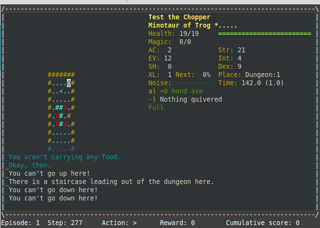

# gym-crawl

The [Crawl Environment](https://github.com/powerbf/gym-crawl) is an OpenAI Gym environment for testing learning machines on Dungeon Crawl Stone Soup (DCSS).



Instructions on how to install and run this gym below.  
Note: I've only run this on Linux, so don't know if it works on other OSes.

# Install DCSS

Note: It is possible to use the terminal (aka console, aka ascii) version of DCSS (either pre-built or built yourself). However, this is deprecated because limited info is available via this interface compared to webtiles.

For best results you should build and install the webtiles version (NOTE: This is not the same as the standalone graphical tiles version). 

Full instructions in the [DCSS GitHub repo](https://github.com/crawl/crawl/blob/master/crawl-ref/INSTALL.md).  

Here are quickstart instructions for Debian-based Linux (e.g. Ubuntu). Modify for your OS as required.  

### Install pre-requisites:
```bash
sudo apt install build-essential libncursesw5-dev bison flex liblua5.1-0-dev \
libsqlite3-dev libz-dev pkg-config python-yaml binutils-gold
```

### Get the code:  
```git clone https://github.com/crawl/crawl.git
cd crawl
git checkout stone_soup-0.24
git submodule update --init
```

Pick a directory where you want to install crawl. I will refer to this as <crawldir> from now on. 
I prefer to use somewhere under my home directory. If <crawldir> is a system folder like /usr/local, you will have to prepend "sudo" to some of these commands.

### Build:  
```
cd crawl-ref/source
make install prefix=<crawldir> WEBTILES=y
cp -r webserver <crawldir>
```

### Install webserver files (optional):  
```
cp -r webserver <crawldir>
cd <crawldir>
mkdir rcs
```
Now edit <crawldir>/webserver/config.py and update all instances of:
```crawl_binary = "./crawl"```
to 
```crawl_binary = "./bin/crawl"```

# Install gym-crawl

### Pre-requisites
* Python 3
* Pip 3 (Python package installer)

Several python modules.  
* pip3 install setuptools
* pip3 install wheel
* pip3 install gym
* pip3 install pynput (needed for the test program only)


### Get code

```bash
git clone https://github.com/powerbf/gym-crawl.git
cd gym-crawl
pip3 install -e .
export CRAWLDIR=<dir where crawl is installed>
```
Note: The program expects to find the DCSS executable at $CRAWLDIR/bin/crawl

# Run Tests
The test program just sends random keystrokes to DCSS. It is not in any way intelligent.
```bash
python3 test-env.py -quick
```
(runs quickly, but only performs movement and eating)
```bash
python3 test-env.py
```
(runs slower, but performs a fuller range of actions - goes into menus for drop, wield, etc.)

